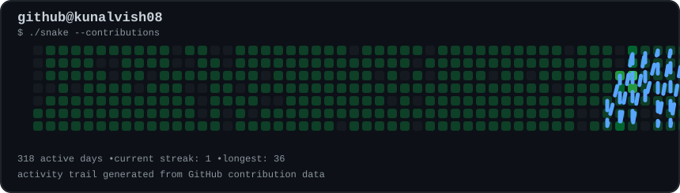

<h3><code>kunal@github ~ $ ./contributions.sh</code></h3>

 

  

<h3><code>kunal@github ~ $ whoami</code></h3>

<table>
<tr>
<td valign="top" width="42%">

</td>

<td valign="top" width="58%">

</td>
</tr>
</table>

<code>kunal@github ~ $ cat about.txt</code>

Computer Science & Engineering • Artificial Intelligence

Developer • Builder • AI / GenAI Explorer

Currently focused on:
→ Software Development Engineering
→ Data Structures & Algorithms
→ Artificial Intelligence
→ Generative AI
→ Full-Stack Development

Building products, learning in public,
and helping students prepare for SDE careers.

<code>kunal@github ~ $ ./current_focus</code>

Area

Focus

💻 SDE

DSA • Problem Solving • System Design

🤖 AI

AI • GenAI • LLMs • AI APIs

🌐 Development

React • Node.js • Next.js • TypeScript

🧠 Learning

DSA Patterns • Projects • Interview Prep

🚀 Building

NexAlgoTrix

<code>kunal@github ~ $ tech --stack</code>

 

  

<code>kunal@github ~ $ ls ./projects</code>

<table>
<tr>

<td width="50%" valign="top">

🚀 NexAlgoTrix

Master DSA Through Patterns, Not Chaos.

An AI-powered DSA learning platform focused on:

Pattern-first learning

AI mentorship

Gamification

Interview simulation

Weakness analytics

Spaced repetition

 

</td>

<td width="50%" valign="top">

⚡ CODExKUNAL

Developer portfolio and personal digital presence.

Focused on:

Software development

AI / GenAI

Projects

Learning journey

Technical content

</td>

</tr>

<tr>

<td width="50%" valign="top">

🤖 RAHI

Real-time assistant project exploring AI-powered interaction and automation.

</td>

<td width="50%" valign="top">

⚡ Smart Indoor Energy Optimization

IIoT-focused project combining:

Sensors

Data

Automation

Energy optimization

</td>

</tr>
</table>

<code>kunal@github ~ $ ./connect</code>

 

  

━━━━━━━━━━━━━━━━━━━━━━━━━━━━━━━━━━━━━━━━━━━━━━━━━━━━━━━━━━

     BUILD  •  LEARN  •  SHARE  •  REPEAT

━━━━━━━━━━━━━━━━━━━━━━━━━━━━━━━━━━━━━━━━━━━━━━━━━━━━━━━━━━

Designed & built by Kunal Vishwakarma

